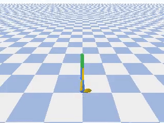
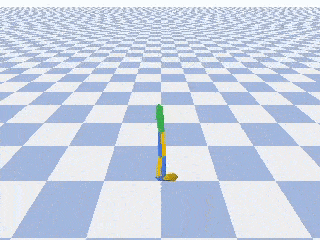

# Deep Reinforcement Learning using PyTorch
Implementing Twin Delayed DDPG (TD3) algorithm from the paper [Addressing Function Approximation Error in Actor-Critic Methods](https://arxiv.org/abs/1802.09477)

This implementations is part of the study of the course [Deep Reinforcement Learning 2.0](https://www.udemy.com/course/deep-reinforcement-learning)

I tryed to refactor and modularize the code to keep it simple and step-by-step, to be easy to follow with the algorithm in the paper.

This algorithm is a Policy Gradient Algorithm, and was tested in environment with continous actions.

## Walker
This environment generate states of 22 float numbers and take actions of 6 floats number in range [-1, 1]

#### Begin of learn: walker dont keep stand up.

#### After (~100k episodes): walker keep stand up and fall down after a little.

#### After (~400k episodes): walker can walk without falls.
